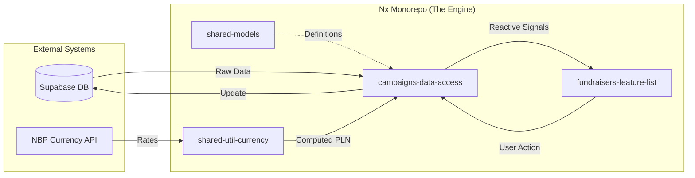

# Architektura Systemu

```mermaid
graph LR
    subgraph "External Systems"
        DB[(Supabase DB)]
        API[NBP Currency API]
    end

    subgraph "Nx Monorepo (The Engine)"
        Models[shared-models]
        Store[campaigns-data-access]
        Logic[shared-util-currency]
        UI[fundraisers-feature-list]
    end

    DB -->|Raw Data| Store
    API -->|Rates| Logic
    Models -.->|Definitions| Store
    Logic -->|Computed PLN| Store
    Store -->|Reactive Signals| UI
    UI -->|User Action| Store
    Store -->|Update| DB
```
